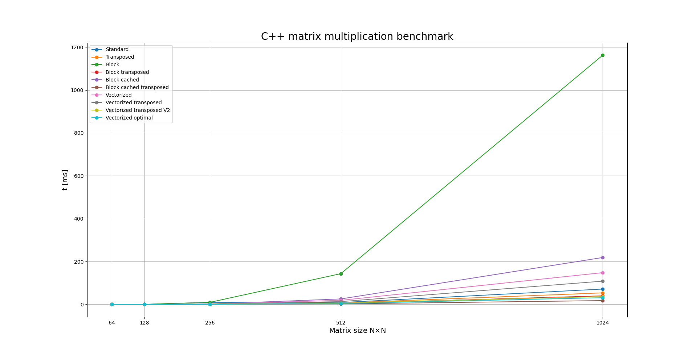
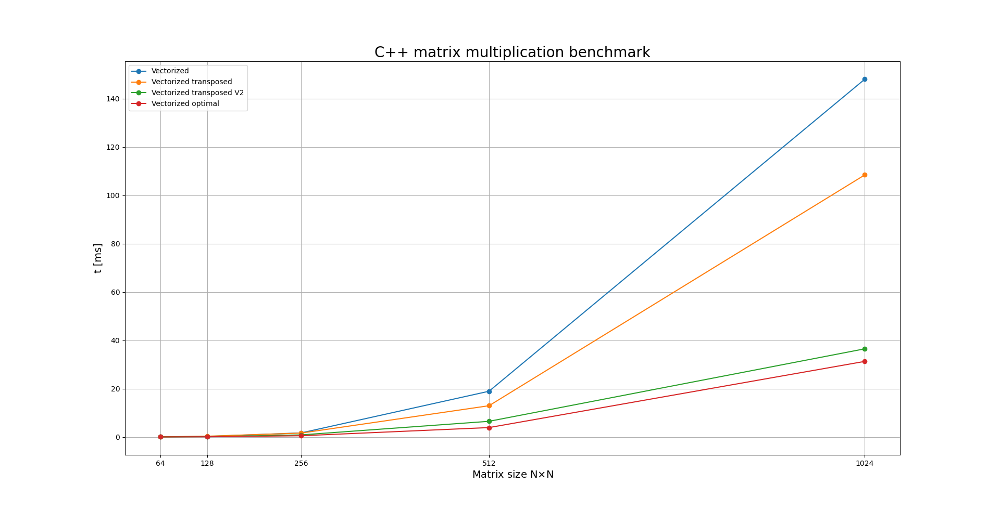
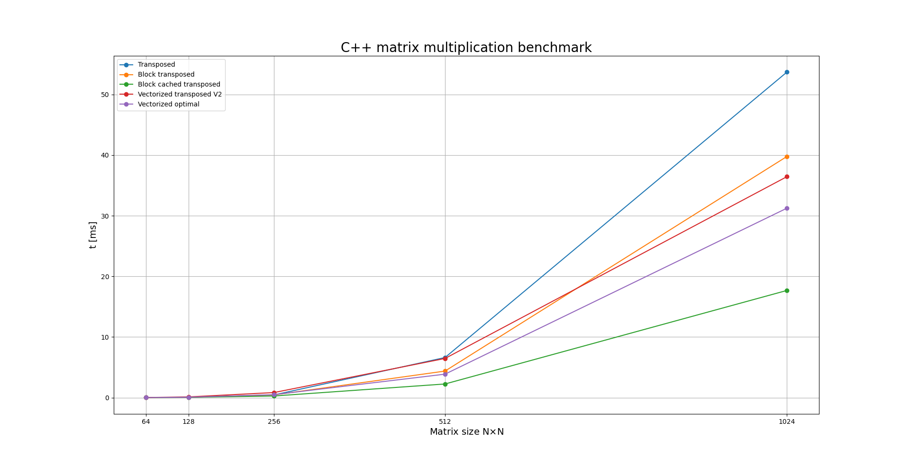

# C-GEMM
C-GEMM - C++ GE-neral M-atrix M-ultiplication benchmarks 

This repo and  <a href="https://github.com/Darakhsh1999/PyGEMM">PyGEMM</a> aims to investigate matrix multiplication benchmarks for C/C++ compared to Python. The matrix multiplication $C = AB$ is performed where $A,B$ are square matrices of size $(N,N)$.

Here the timings for all the matmuls are presented for the different sizes matrices $(N,N)$.

Here we compare using vector instructions defined in the immintrin.h header which utilizes the vector register in the CPU.

From the 10 different algorithm, the top 5 are shown. Under optimized settings "vectorized optimal" was the fastest, however, due to compiler issues, it was mediocre during benchmark runs. vectorized_matmul_optimal()  reached around 140 GFLOP/s on single thread performance, performing better than Numpy's 137 GFLOP/s. block_matmul_cached_transposed() was the best during the benchmarks, however it's very likely that the compiler vectorizes the algorithm and unrolls the loads & stores. This remains to be confirmed by looking through the assembly code instructions.

